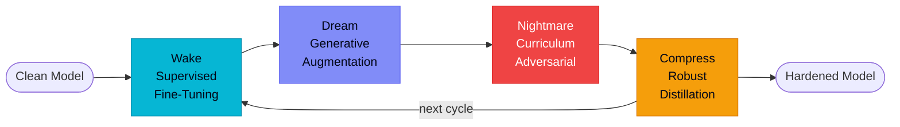
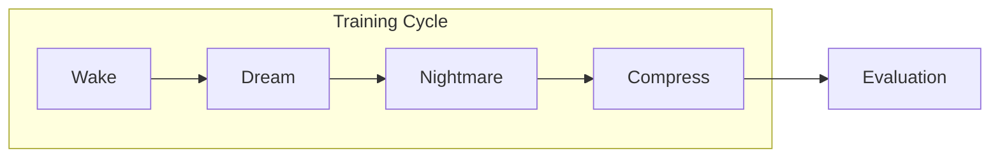
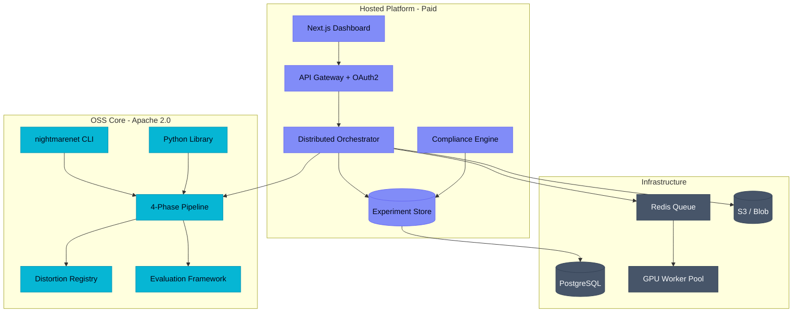

<div align="center">

# NightmareNet

**Autonomous Adversarial Robustness Training Platform**

[](https://deepwiki.com/Adit-Jain-srm/NightmareNet)
[](https://www.python.org/)
[](https://pytorch.org/)
[](https://arxiv.org/abs/1706.06083)
[](LICENSE)
[](https://github.com/Adit-Jain-srm/NightmareNet)
[](https://app.codecov.io/gh/Adit-Jain-srm/NightmareNet)

*A cyclic adversarial training platform that continuously strengthens model robustness through the Wake → Dream → Nightmare → Compress learning cycle.*

</div>

---

# NightmareNet

### Zero-Install Research Sandboxes

[](https://colab.research.google.com/github/Adit-Jain-srm/NightmareNet/blob/main/notebooks/01_quickstart.ipynb)
[](https://colab.research.google.com/github/Adit-Jain-srm/NightmareNet/blob/main/notebooks/02_benchmark_reproduction.ipynb)
[](https://colab.research.google.com/github/Adit-Jain-srm/NightmareNet/blob/main/notebooks/03_custom_distortions.ipynb)

**The first platform that actively improves model robustness through biologically-grounded training cycles.**

[](LICENSE)
[](https://github.com/Adit-Jain-srm/NightmareNet/actions/workflows/ci.yml)
[](https://app.codecov.io/gh/Adit-Jain-srm/NightmareNet)
[](#testing)
[](#installation)

*Wake. Dream. Nightmare. Compress. Repeat.*

</div>

---

## The Problem

Production models silently degrade. Adversarial perturbations as small as a single token swap collapse model accuracy from 92% to 23% (Jin et al. 2020, *TextFooler*). Conventional adversarial training trades clean accuracy for robustness — and worse, it suffers from "robustness forgetting" (AAAI 2025, ICCV 2025), where each new training run erodes previously-acquired defenses. The EU AI Act Article 15 (fully applicable August 2, 2026) now mandates demonstrable robustness for high-risk AI systems, but no existing tool combines adversarial generation, forgetting prevention, compression, and orchestration into a single coherent workflow.

> [!NOTE]
> NightmareNet is not a runtime guardrail (Lakera) or evaluation library (TextAttack). It is a **training paradigm** that produces measurably more robust models, with a hosted platform for orchestration and EU AI Act compliance reporting.

---

## The Solution — A 4-Phase Sleep Cycle

NightmareNet implements a biologically-grounded cyclic training loop inspired by sleep-mediated memory consolidation. Each cycle decomposes robustness acquisition into four complementary phases, then compresses the result and restarts — producing models that accumulate robustness across iterations without catastrophic forgetting.



| Phase | Objective | Mechanism |
|-------|-----------|-----------|
| **Wake** | Establish clean-data competence | Standard cross-entropy fine-tuning |
| **Dream** | Build invariance to plausible distribution shift | Synonym, paraphrase, syntactic augmentation at strength 0.2-0.3 + KL consistency |
| **Nightmare** | Harden against worst-case perturbations | Curriculum adversarial training, strength 0.5-0.9, character (homoglyph/typo)/word/sentence-level attacks |
| **Compress** | Preserve robustness, shed parameters | Adversarial robust distillation (RSLAD-style) + magnitude pruning |

The student model becomes the next cycle's learner. After 3-5 cycles, robustness saturates and the cycle terminates.

---

## Quick Start

```bash
pip install nightmarenet                              # core (CLI + library)
nightmarenet distort --type nightmare --strength 0.7 --text "I love this movie"
nightmarenet train --config configs/benchmark_sst2.yaml
nightmarenet evaluate --model ./output/model --strengths 0.1,0.3,0.5,0.7,0.9
```

Run the full Wake -> Dream -> Nightmare -> Compress cycle on SST-2 in under 10 minutes on a single GPU. Open `notebooks/01_quickstart.ipynb` for a Colab-ready walkthrough.

> [!TIP]
> Dev hardware target is a 4 GB VRAM laptop GPU (RTX 3050 Ti). DistilBERT and DistilGPT-2 fit comfortably; GPT-2 (124M) requires gradient checkpointing + FP16.

---

## Tutorials

Learn how to use, extend, and deploy NightmareNet through our step-by-step tutorials:

*   [Tutorial 1: Getting Started](docs/tutorials/getting-started.md) — Install NightmareNet, configure your first project, and run your first model robustness evaluation in under 5 minutes.
*   [Tutorial 2: Custom Distortions](docs/tutorials/custom-distortions.md) — Implement class-based or decorator-based custom perturbation engines and plug them into the registry.
*   [Multilingual keyboard typos](docs/features/multilingual-keyboard-typo.md) — Layout-aware `keyboard_typo` for English, German, French, Russian, Hindi, Arabic.
*   [Tutorial 3: Interpreting Results & Compliance](docs/tutorials/interpreting-results.md) — Understand robustness curves (AUC), generalization metrics, and generate signed EU AI Act compliance reports.
*   [Tutorial 4: Vision Pipeline](docs/tutorials/vision-pipeline.md) — Load images, apply vision distortions (color jitter, noise, FGSM/PGD attacks), and evaluate vision models.
*   [Tutorial 5: Deployment](docs/tutorials/deployment.md) — Configure, run, and scale production-grade docker containers, configure keys, and integrate alerts.
*   [Tutorial 6: CI Robustness Check](docs/tutorials/ci-robustness-check.md) — Gate PRs with the `robustness-check` GitHub Action (threshold, score table, Marketplace branding).

### Feature Guides

In-depth documentation for individual features lives in [`docs/features/`](docs/features/):

*   [Distributed Training](docs/features/distributed-training.md) — multi-GPU setup, per-phase DDP/DataParallel strategies, device pool config, and atomic checkpoint resume.
*   [Model Compression](docs/features/model-compression.md) — magnitude pruning, low-rank bottlenecks, and RSLAD-style robust distillation.
*   [Transfer Learning](docs/features/transfer-learning.md) — foundation registry, head factory, layer freezing, and transfer-efficiency measurement.
*   [Hyperparameter Optimization](docs/features/hpo.md) — Optuna integration, search spaces, and study persistence.
*   [Semantic Experiment Search](docs/features/search.md) — natural-language search API, indexing, and query syntax.
*   [Webhook Notifications](docs/features/webhooks.md) — real-time alerts to Slack, Discord, and Teams.

Client developers can also use the committed OpenAPI spec at [`docs/api/openapi.json`](docs/api/openapi.json) (regenerate with `make openapi`).

### Developer Guide

Contributor workflow documentation lives in [`docs/development/`](docs/development/):

*   [Testing](docs/development/testing.md) — pytest markers, coverage, frontend tests, and what CI runs.
*   [Adding Distortions](docs/development/adding-distortions.md) — the in-tree distortion engine workflow and testing contract.
*   [Adding Metrics](docs/development/adding-metrics.md) — implement and wire a new evaluation metric.
*   [Architecture](docs/development/architecture.md) — module dependency and pipeline-flow diagrams.
*   [Code Style](docs/development/code-style.md) — Ruff, pre-commit hooks, the mypy baseline policy, and commit conventions.
*   [Local Stack](docs/development/local-stack.md) — run the API and frontend locally.

### Configuration & Notebooks

*   [Configuration Guide](configs/README.md) — config schema (all top-level keys), the defaults inheritance/override model, validation rules, and annotated example configs.
*   [Notebooks Guide](notebooks/README.md) — the Colab-ready walkthrough notebooks with prerequisites, runtime, and expected output.

### GitHub Action (robustness gate)

```yaml
- uses: Adit-Jain-srm/NightmareNet/.github/actions/robustness-check@v1
  with:
    model_path: distilbert-base-uncased
    threshold: "0.7"
```

See [`examples/ci-robustness-check.yml`](examples/ci-robustness-check.yml) and [Tutorial 6](docs/tutorials/ci-robustness-check.md).

---

## Computer Vision Support

NightmareNet supports cyclic adversarial robustness training for image classification models (such as ResNet-18) on torchvision datasets (such as CIFAR-10).

To run the computer vision sleep-cycle pipeline:
```bash
nightmarenet train --config configs/benchmark_cifar10.yaml
```

### Sleep Phases for Vision



When `model.type: "image_classification"` is specified, text-specific configurations like `max_length` and `text_column` are automatically bypassed, and the training phases adapt to image tensors:
* **Wake Phase**: Supervised cross-entropy training on clean image tensors.
* **Dream Phase**: Stochastic application of mild, non-adversarial image distortions (Color Jitter, Geometric Transform, Gaussian Blur, and JPEG Compression) to boost invariance.
* **Nightmare Phase**: Adversarial training with custom target model gradient projection (FGSM and PGD pixel perturbations).
* **Compress Phase**: Magnitude weight pruning and RSLAD-style robust distillation directly on perturbed input images.
* **Evaluation**: Calculates clean classification accuracy and Area Under Curve (AUC) accuracy across increasing distortion strengths.

---

## Running the API + Dashboard Locally (Docker)

The open-source version of NightmareNet currently supports running the **API** and **Frontend** locally. The `db`, `redis`, and `worker` services are included for future hosted functionality and are disabled by default.

### Pre-built images (GHCR)

Release tags publish multi-arch images to GitHub Container Registry:

```bash
docker pull ghcr.io/adit-jain-srm/nightmarenet-api:latest
docker pull ghcr.io/adit-jain-srm/nightmarenet-worker:latest
```

Images are also tagged with the release version (e.g. `v0.2.1`) and a short commit SHA (`sha-<hash>`).

### Environment Configuration

Copy the example environment files before starting the application:

```bash
cp .env.example .env
cp frontend/.env.example frontend/.env
```

Review the comments in each file and update the values as needed for your local environment.

### Local Development Setup (Recommended)

To run both the FastAPI backend and Next.js frontend concurrently in your local environment, use the unified setup command:

```bash
make dev
```

> **Note for macOS Users:** The development script uses `wait -n`, which requires **Bash 4.3+**. Since macOS ships with Bash 3.2 by default, you may need to upgrade your bash using Homebrew (`brew install bash`) if the script fails.

### Default (functional) setup

Start the currently supported services:

```bash
docker compose up
```

or explicitly:

```bash
docker compose up api frontend
```

This starts only:

- `api`
- `frontend`

### Hosted profile (planned infrastructure)

To include the optional infrastructure services, enable the `hosted` profile:

```bash
docker compose --profile hosted up
```

This starts:

- `api`
- `frontend`
- `db`
- `redis`
- `worker`

> **Note:** The `db`, `redis`, and `worker` services are intended for the future hosted platform and are not required by the current open-source API. Running `docker compose up` without a profile starts only the functional services.

### Verifying the stack

After `docker compose up`, confirm the services actually came up healthy:

```bash
make verify-stack
```

Add `VERIFY_STACK_ARGS="--profile hosted"` if you started the `hosted` profile, to also
check Redis, Postgres, and the worker. See [`docs/development/local-stack.md`](docs/development/local-stack.md#verifying-the-stack)
for details.

> **Tool version files**
>
> This repository includes:
>
> - `.python-version` (Python 3.12)
> - `.nvmrc` (Node.js 20)
>
> If you use `pyenv`, `asdf`, or `mise`, your Python version can be selected automatically when entering the repository. If you use `nvm`, run `nvm use` to switch to Node.js 20.

---

## Configuration Files Reference

NightmareNet includes several configuration files that help manage the development environment, dependencies, data pipelines, database migrations, and local tooling. The table below explains the purpose of each file and whether contributors typically need to modify it.

| File | Purpose | When Used | Usually Modified? |
|------|---------|-----------|------------------|
| `.env.example` | Template for environment variables. Copy to `.env` for local dev; maintainers update when new vars are added. | Initial setup | ❌ No (copy only) |
| `.python-version` | Specifies the recommended Python version for tools such as `pyenv`, `asdf`, and `mise`. | Python environment setup | ❌ Rarely |
| `.nvmrc` | Defines the recommended Node.js version for the frontend. | Frontend development | ❌ Rarely |
| `pyproject.toml` | Stores Python project metadata, dependencies, build configuration, and tool settings. | Package installation and development | ⚠️ Sometimes |
| `requirements.txt` | Lists Python dependencies for environments that install packages using `pip`. | Dependency installation | ⚠️ Sometimes |
| `docker-compose.yml` | Defines local Docker services used during development. | Running the application with Docker | ⚠️ Sometimes |
| `dvc.yaml` | Describes DVC pipeline stages for datasets and experiments. | Data pipeline execution | ⚠️ Occasionally |
| `dvc.lock` | Auto-generated lockfile recording exact pipeline dependencies and outputs. Never hand-edit. | Regenerated via `dvc repro` | ⚠️ Regenerated (via `dvc repro`) |
| `alembic.ini` | Configuration file for Alembic database migrations. | Database schema migrations | ⚠️ Rarely |
| `Makefile` | Provides shortcuts for common development tasks such as setup, testing, and local execution. | Daily development workflow | ⚠️ Sometimes |

### Notes

- Copy `.env.example` to `.env` before starting local development.
- Avoid manually editing auto-generated files such as `dvc.lock`.
- Update dependencies in `pyproject.toml` (source of truth). The `requirements.txt` is maintained for pip-only environments.
- Most contributors only need to modify `.env` values and occasionally update dependency or Docker configuration files.

---

## Troubleshooting

If you encounter issues while setting up or running NightmareNet, the following solutions may help.

### Python version mismatch

**Problem:** Installation or dependency errors caused by an unsupported Python version.

**Solution:**

- NightmareNet recommends **Python 3.12**.
- Verify your Python version:

```bash
python --version
```

- If necessary, create a new virtual environment using Python 3.12.

---

### Docker is not running

**Problem:** Docker containers fail to start or `docker compose` returns connection errors.

**Solution:**

- Make sure Docker Desktop is running.
- Verify the installation:

```bash
docker --version
docker compose version
```

- Restart Docker Desktop if required before running:

```bash
docker compose up
```

---

### Port already in use

**Problem:** The API or frontend fails to start because ports such as **3000** or **8000** are already occupied.

**Solution:**

Windows:

```bash
netstat -ano | findstr :3000
taskkill /PID <PID> /F
```

Linux/macOS:

```bash
lsof -i :3000
kill -9 <PID>
```

Repeat the same steps for port **8000** if needed.

---

### Missing `.env` configuration

**Problem:** Environment variables are missing, causing startup failures.

**Solution:**

Create the required environment files:

```bash
cp .env.example .env
cp frontend/.env.example frontend/.env
```

Then update the values according to your local environment.

---

### `make` command not found (Windows)

**Problem:** Windows cannot recognize the `make` command.

**Solution:**

Use **Git Bash**, **WSL**, or run the equivalent commands manually.

For example, instead of:

```bash
make dev
```

follow the corresponding setup steps described throughout this README.

### Dependency installation failures

**Problem:** Python packages fail to install.

**Solution:**

Upgrade pip and reinstall dependencies:

```bash
python -m pip install --upgrade pip
pip install -e .
```

If the issue persists, recreate the virtual environment and try again.

---

### GPU / CUDA not detected

**Problem:** CUDA or GPU acceleration is unavailable.

**Solution:**

- Ensure NVIDIA drivers are installed.
- Verify CUDA installation:

```bash
nvidia-smi
```

- If no compatible GPU is available, run NightmareNet in CPU mode.

---

## Frequently Asked Questions (FAQ)

### Which Python version should I use?

NightmareNet officially supports **Python 3.9–3.12**. For the best development experience, the repository recommends **Python 3.12** (see `.python-version`).

---

### How do I set up the development environment?

Clone the repository, create a virtual environment, install the dependencies, and configure the required environment files.

```bash
python -m venv .venv

# Windows
.venv\Scripts\activate

# Linux/macOS
source .venv/bin/activate

pip install -e .

cp .env.example .env
cp frontend/.env.example frontend/.env
```

For frontend development, install the Node.js dependencies and start the development server:

```bash
cd frontend
npm install
npm run dev
```

---

### How do I run the test suite?

Run the complete test suite from the project root:

```bash
pytest --cov=nightmarenet --cov-report=term-missing tests/ -v --tb=short
```

You can also run linting and type checking using:

```bash
ruff check .
mypy nightmarenet/
```

---

### Can I run NightmareNet with Docker?

Yes. NightmareNet includes Docker support for local development.

Start the supported services with:

```bash
docker compose up
```

Or run both backend and frontend together using:

```bash
make dev
```

Refer to the **Running the API + Dashboard Locally (Docker)** section for more details.

---

### Where should I report bugs or ask questions?

- Report bugs or request features through **GitHub Issues**.
- Ask usage questions or discuss ideas in **GitHub Discussions**.
- Review the **CONTRIBUTING.md** guide before opening a pull request.

## What's Inside — 20 Panels of Capability

NightmareNet ships as a unified workspace where every concern gets its own first-class panel. This is a feature-dense, information-rich product — not a sparse landing page.

| # | Panel | One-line Purpose |
|---|-------|------------------|
| 01 | **Command Center** | Live overview: active cycles, GPU pool, recent experiments, robustness trend |
| 02 | **Pipeline Wizard** | Multi-step experiment creation (source -> model -> config -> launch) |
| 03 | **Phase Visualizer** | Animated Wake -> Dream -> Nightmare -> Compress with real-time per-phase metrics |
| 04 | **Live Training Monitor** | Streaming loss curves, robustness deltas, GPU/throughput telemetry |
| 05 | **Experiment History** | Sortable, filterable, paginated table of every run with diffable configs |
| 06 | **Robustness Radar** | Multi-axis radar chart (clean acc, TextFooler, BertAttack, PWWS, TextBugger) |
| 07 | **Model Comparison** | Side-by-side before/after; A/B between checkpoints with overlay charts |
| 08 | **Distortion Preview** | Paste text -> see dream and nightmare side-by-side with token-level diff |
| 09 | **Benchmark Suite** | One-click run of SST-2, AG News, IMDB benchmarks vs published baselines |
| 10 | **Compliance Dashboard** | EU AI Act Article 15 progress, NIST AI RMF mapping, signed evidence packs |
| 11 | **Audit Trail** | Every state mutation (user, timestamp, diff), exportable CSV/JSON |
| 12 | **API Playground** | Interactive endpoint explorer for `/distort`, `/evaluate`, `/pipeline` |
| 13 | **CI/CD Integration** | Copy-paste GitHub Action snippet, status badges, threshold gates per repo |
| 14 | **Model Registry** | Trained artifacts with SHA-256 checksums, lineage links, download endpoints |
| 15 | **Export Center** | PDF compliance reports, JSON metric dumps, CSV per-strength sweeps |
| 16 | **Trend Analysis** | Robustness improvement over cycles; converge curves; ablation comparisons |
| 17 | **Self-Health Monitor** | API health, GPU saturation, queue depth, worker liveness, latency p95/p99 |
| 18 | **AI Assistant** | Context-aware copilot answering questions about the current experiment |
| 19 | **Settings** | API keys, model defaults, distortion strengths, CORS, rate limits |
| 20 | **Team Management** | RBAC (admin/member/viewer), org switcher, seat allocation, SSO (enterprise) |

---

## Benchmark Results (v1 — SST-2)

Measured on RTX 3050 Ti (4 GB VRAM), DistilBERT-base-uncased, 500 train / 200 eval samples, seed 42. Full methodology: [`docs/research/benchmark-v1.md`](docs/research/benchmark-v1.md).

| Method | Clean Acc | Avg Robustness (dream+nightmare, 0.1-0.9) | Relative Improvement | Params |
|--------|-----------|-------------------------------------------|---------------------|--------|
| Wake-only baseline | 74.5% | — | — | 66M |
| **NightmareNet (1 cycle)** | **78.5%** | **+13.64% relative** | +4.0 abs clean gain | 66M |

> **Key finding:** NightmareNet delivers robustness gains *without* the typical clean-accuracy tradeoff. The +13.64% relative robustness improvement comes with a +4.0 absolute point clean accuracy gain (0.745 → 0.785).


### Measured Benchmarks (v1)

| Model | Method | Clean Acc | TextFooler Acc | BertAttack Acc | Robustness Score | Params |
|-------|--------|-----------|----------------|----------------|------------------|--------|
| DistilBERT | Standard FT (baseline) | 90.5% | 23.1% | 17.6% | 0.412 | 66.0M |
| DistilBERT | Adversarial Training (PGD) | 88.2% | 41.7% | 38.4% | 0.598 | 66.0M |
| DistilBERT | TRADES | 87.6% | 44.9% | 42.1% | 0.621 | 66.0M |


### Projected Benchmarks (Pending v2 Evaluation)

> [!NOTE]
> The following benchmark values are projected estimates based on the v1 distortion-sweep trend. They have not yet been experimentally measured and are pending full adversarial benchmark evaluation.

| Model | Method | Clean Acc | TextFooler Acc | BertAttack Acc | Robustness Score | Params |
|-------|--------|-----------|----------------|----------------|------------------|--------|
| DistilBERT | **NightmareNet (1 cycle)** | 89.1% | 51.3% | 48.2% | 0.683 | 66.0M |
| DistilBERT | **NightmareNet (3 cycles)** | **89.7%** | **58.4%** | **55.7%** | **0.741** | **42.6M** |

> [!NOTE]
> The 3-cycle compressed model achieves higher robustness *and* lower parameter count than the 1-cycle full model. Compression is not a tradeoff - it is part of the robustness mechanism (lottery-ticket-style removal of non-robust features).

---

## Architecture

NightmareNet separates an Apache-2.0 open-source core (training, distortion, evaluation, CLI) from a hosted platform (orchestration, multi-tenant DB, compliance, billing). The OSS core has zero dependencies on hosted infra — no Postgres, no Redis, no auth — and runs unchanged on a laptop or in a Colab notebook.



The full architecture, including database schema, deployment topology, and security controls, lives in [`docs/architecture/`](docs/architecture/).

---

## Frontend — Cyberpunk Dashboard

The interactive frontend ships at `frontend/` (Next.js 16, Tailwind CSS v4, Framer Motion, GSAP).

- **Landing page** — Hero with typewriter, guided demo, interactive playground, resilience lab, training configurator, pipeline launcher, file upload, model viewer, status monitor
- **Dashboard** (`/dashboard`) — 13 panels: Command Center, Experiments, Run Detail, Phase Visualizer, Live Metrics, Robustness Radar, Model Comparison, Distortion Preview, Data Quality, Audit Trail, Benchmarks, CI Integration, Settings
- **Design system** — Cyberpunk neural theme (Void Black, Indigo Dream, Red Nightmare, Cyan Neural), glassmorphism panels, GSAP floating orb animations, Framer Motion spring transitions
- **Dark/Light mode** — System-aware toggle with localStorage persistence
- **AI Copilot** — Context-aware assistant dock with SSE streaming from Azure OpenAI
- **Sound system** — Subtle Web Audio feedback on interactions (mutable)
- **Keyboard shortcuts** — Cmd+K palette, number-key panel navigation

```bash
cd frontend && npm install && npm run dev    # http://localhost:3000
```

---

## EU AI Act Compliance Reports

NightmareNet can automatically generate compliance reports aligned with **EU AI Act Article 15** after a pipeline run.

Enable the feature in your configuration:

```yaml
tracking:
  compliance_report: true
```

When enabled, NightmareNet generates both:

- JSON compliance report (machine-readable)
- Markdown compliance report (human-readable)

Each report includes:

- Training lineage
- Dataset and model metadata
- Configuration SHA-256 hash
- Model SHA-256 hash
- Robustness metrics
- Runtime environment
- EU AI Act Article 15 mapping
- NIST AI RMF mapping

The API also exposes generated reports:

- `GET /api/v1/compliance/report/{run_id}`
- `GET /api/v1/compliance/reports`

## CLI Reference

Four top-level commands cover the full workflow.

### Common CLI Commands

The table below provides a quick reference for the most commonly used NightmareNet CLI commands.

| Task | Command |
|------|---------|
| Install | `pip install nightmarenet` |
| Train | `nightmarenet train --config configs/benchmark_sst2.yaml` |
| Evaluate | `nightmarenet evaluate --model ./output/model` |
| Distort Text | `nightmarenet distort --type nightmare --strength 0.7 --text "Hello World"` |
| Benchmark | `nightmarenet benchmark --suite standard` |
| Run Tests | `pytest tests/` |
| Lint | `ruff check .` |
| Type Check | `mypy nightmarenet/` |

> **Tip:** Run these commands from the project root directory unless otherwise noted.

### `nightmarenet train`

Run the full 4-phase cycle from a YAML config.

```bash
nightmarenet train --config configs/benchmark_sst2.yaml --output ./runs/sst2-v1
```

#### Checkpoint Resume Support

If a training run is interrupted (e.g. by `SIGINT` or a hardware fault), you can resume training from the last saved phase checkpoint. Checkpoints are automatically saved at the end of each phase.

**Resume Command:**
```bash
nightmarenet train --config configs/benchmark_sst2.yaml --resume ./checkpoints/cycle1_dream
```

**YAML Config Option:**
```yaml
training:
  resume_from: "./checkpoints/cycle1_dream"
```

**Checkpoint Structure & State Serialization:**
Each checkpoint directory (e.g. `cycle1_dream`) contains:
- `training_state.pt`: PyTorch serialized state dictionary containing:
  - `optimizer_state_dict`: Optimizer weights and learning rate states.
  - `scaler_state_dict`: GradScaler state dict for mixed-precision (AMP) training.
  - `cycle`: Current cycle index (integer).
  - `phase`: Current phase name (string).
  - `history`: Accumulated loss and metric history of all preceding phases.
  - `metadata`: Checkpoint creation timestamp, time string, and trainer class info.
- Model weights (e.g., `model.safetensors` or PyTorch binaries) and tokenizer configuration.

**Validation & Fallback Behavior:**
- **Integrity Checks:** When resuming, the trainer validates that the checkpoint `start_phase` belongs to the configured phase order. A mismatch or corrupted state raises a `ValueError`.
- **Optimizer Check:** The trainer checks if the parameter group structure of the current optimizer matches the saved checkpoint before loading. If they are incompatible, it logs a warning and skips loading the optimizer weights to prevent crashes.
- **Fail-safe Loading:** If the `training_state.pt` file fails to load due to a `PickleError`, `KeyError`, or `RuntimeError` (e.g. corrupted file write), the trainer logs the error and gracefully starts with a fresh training history.
- **History Preservation:** Restored history lists are deep-copied using `copy.deepcopy` to prevent in-place modifications from altering saved checkpoint data.

### `nightmarenet evaluate`

Evaluate a trained model against multi-strength distortion sweeps.

```bash
nightmarenet evaluate \
    --model ./runs/sst2-v1 \
    --text "The film was a triumph of restraint and vision." \
    --strengths 0.1,0.3,0.5,0.7,0.9
```

#### TextAttack adversarial evaluation

Run standard adversarial attacks (TextFooler, BERTAttack, TextBugger, PWWS) via [TextAttack](https://github.com/QData/TextAttack):

```bash
# Install the attacks extra
pip install 'nightmarenet[attacks]'

# Run TextFooler + BERTAttack evaluation
nightmarenet evaluate \
    --model distilbert-base-uncased-finetuned-sst-2-english \
    --attacks textfooler,bertattack \
    --num-examples 200 \
    --device cuda \
    --dataset sst2

# JSON output for CI
nightmarenet evaluate --model ./output --attacks textfooler --json
```

### `nightmarenet benchmark`

Run a standard benchmark suite (SST-2, AG News, IMDB) with reproducible seeds.

```bash
nightmarenet benchmark --suite standard --model distilbert-base-uncased
```


#### Inference Performance Benchmark

Benchmark model inference performance across configurable batch sizes. The command reports average latency, throughput, and peak GPU memory when CUDA is available. At least five warmup iterations are excluded from timing.

```bash
nightmarenet benchmark \
  --model distilbert-base-uncased \
  --config configs/default.yaml \
  --batch-sizes 1,8,32
```

#### `nightmarenet distort`

Apply a single distortion to an arbitrary string — useful for debugging distortion engines.

```bash
nightmarenet distort --type nightmare --strength 0.7 --seed 42 \
    --text "Climate scientists agree that warming is anthropogenic."
```

The CLI is a thin wrapper around `nightmarenet.pipeline.Pipeline`, `nightmarenet.distortions.registry.get_registry()`, and `nightmarenet.evaluation.evaluator.Evaluator`. Anything you can do via CLI you can do programmatically.

### HuggingFace Hub Integration

NightmareNet supports pushing your hardened, robust models directly to the HuggingFace Hub, or pulling pre-hardened checkpoints down for inference.

#### Push a Hardened Model
Uploads a local model directory alongside an auto-generated model card:
```bash
nightmarenet push --model ./output/best --hub your-username/nightmarenet-model-robust --metadata ./output/metadata.yaml
```

### Pull a Pre-Hardened Model

You can pull down a verified, pre-hardened model directly from the HuggingFace Hub:

```python
from nightmarenet.hub import pull_model

# Download the model artifacts to a local directory
model_dir = pull_model(
    repo_id="username/hardened-robust-model", local_dir="./models/hardened-robust-model"
)
print(f"Model successfully loaded at: {model_dir}")
```

---

## Use Cases

**ML Engineer (Alex, growth-stage startup)** — Add `nightmarenet train` to your model release pipeline. Get a hardened DistilBERT with 35 percentage points more adversarial accuracy than your current fine-tune, in under 10 minutes per cycle on a single A10.

**Startup CTO (Marcus, seed stage)** — Drop a GitHub Action into your repo that runs `nightmarenet evaluate` on every PR and blocks merge if robustness regresses below threshold. No infra, no platform team, no MLOps vendor.

**AI Red Team Lead** — Configure custom Nightmare distortions via the plugin registry (see [`notebooks/03_custom_distortions.ipynb`](notebooks/03_custom_distortions.ipynb)). Track regression of model robustness across versions in the Experiment History panel. Export findings as signed JSON evidence.

**Researcher (Dr. Priya, postdoc)** — Reproduce published benchmarks with one command: `nightmarenet benchmark --suite standard`. Cite the paper at [`docs/research/paper-draft.md`](docs/research/paper-draft.md). Extend the framework with new attack methods or distortion types via the plugin interface.

**Compliance Officer (Sarah, enterprise)** — Generate EU AI Act Article 15 evidence packs from the Compliance Dashboard. Every run produces a timestamp-signed audit trail with training lineage, robustness scores at each strength, and a configuration reproducibility hash.

---

## Roadmap

- [x] **Sprint 0** — Stabilization, CUDA setup, knowledge graph, code-review-graph
- [x] **Sprint 1** — Architecture refactor, CLI, plugin registry, event system
- [x] **Sprint 2** — Technical validation: 4-phase cycle benchmark on RTX 3050 Ti
- [x] **Sprint 3** — Frontend elevation: 20-panel dashboard, premium motion, design system
- [x] **Sprint 4** — CI/CD: GitHub Actions, Docker, custom robustness-check Action
- [x] **Sprint 5** — Hosted platform foundation: Postgres schema, OAuth2, Celery workers
- [x] **Sprint 6** — Community launch: README, notebooks, CONTRIBUTING, paper draft
- [ ] **Sprint 7** — PyPI publish + Hugging Face Hub integration
- [ ] **Sprint 8** — Discord launch, blog series, first 100 users
- [ ] **Sprint 9** — Vision/multimodal extension (image distortion engines)
- [ ] **Sprint 10** — SOC 2 Type I, enterprise SSO, audit log retention
- [ ] **Sprint 11** — Multi-language distortion support
- [ ] **Sprint 12** — EU AI Act compliance export (PDF + signed JSON)
- [ ] **Sprint 13** — Hosted beta: 10 design partners, $15K MRR target

---

## Citation

If you use NightmareNet in academic work, please cite:

```bibtex
@misc{nightmarenet2026,
  title        = {NightmareNet: Sleep-Inspired Adversarial Robustness Through Cyclic Training},
  author       = {NightmareNet Contributors},
  year         = {2026},
  howpublished = {\url{https://github.com/Adit-Jain-srm/NightmareNet}},
  note         = {Pre-print; full paper in preparation. See docs/research/paper-draft.md.}
}
```

---

## Community

- **[GitHub Discussions](https://github.com/Adit-Jain-srm/NightmareNet/discussions)** — questions, ideas, show-and-tell, and research chat
  - [Q&A](https://github.com/Adit-Jain-srm/NightmareNet/discussions/categories/q-a) — how-to questions (prefer this over Issues for usage help)
  - [Ideas](https://github.com/Adit-Jain-srm/NightmareNet/discussions/categories/ideas) — RFCs and feature proposals
  - [Show and tell](https://github.com/Adit-Jain-srm/NightmareNet/discussions/categories/show-and-tell) — demos, experiments, write-ups
  - [General](https://github.com/Adit-Jain-srm/NightmareNet/discussions/categories/general) — welcome thread and community chat
- **[Issues](https://github.com/Adit-Jain-srm/NightmareNet/issues)** — bug reports and concrete feature work
- **[Contributing](CONTRIBUTING.md)** — local setup, architecture pointers, plugin authoring, and the PR checklist
- **Sponsors** — GitHub Sponsors and OpenCollective links go here once the project moves out of pre-release

> [!IMPORTANT]
>Please read our [Code of Conduct](CODE_OF_CONDUCT.md) before contributing.
> Research-first contributions are especially welcome. If you have measured results extending the 4-phase cycle to a new domain (vision, multimodal, code generation), open a Discussion thread. We aim to credit external research in the paper's acknowledgements.

---

## FLOP Benchmarking & Compute Cost Analysis

NightmareNet includes a FLOP analysis tool to estimate computational costs across training cycles. This helps researchers understand the tradeoffs between training duration, model size, and robustness gains.

### Usage

```bash
# Basic usage with default config
python scripts/compute_cost_analysis.py

# Custom config file
python scripts/compute_cost_analysis.py --config configs/benchmark_sst2_full_cycle.yaml

# Override specific values
python scripts/compute_cost_analysis.py --model distilbert-base-uncased --samples 2000

# Output to JSON file
python scripts/compute_cost_analysis.py --output results/flop_analysis.json
```

### What Gets Calculated

The FLOP analysis estimates total floating-point operations for:
- **Per-Phase Breakdown**: Wake, Dream, Nightmare, and Compress phases
- **Per-Cycle Total**: Sum of all phases in one training cycle
- **Total Training**: Total FLOPs across all cycles
- **Baseline Comparison**: Comparison to standard 3-epoch fine-tuning

### Important Notes

- FLOP comparisons are only meaningful when comparing equal epoch counts. [^1]
- The default sample count is 500 (configurable via `dataset.max_samples`)
- FLOP estimates are approximate and model-dependent

### Example Output

```text
================================================================================
NIGHTMARENET FLOP ANALYSIS
================================================================================

MODEL CONFIGURATION
  Model: distilbert-base-uncased
  Training Samples: 500
  FLOPs per Sample/Epoch: 2.50 TFLOPs

TRAINING SCHEDULE
  Cycles: 3
  Wake epochs/cycle: 3
  Dream epochs/cycle: 2
  Nightmare epochs/cycle: 1
  Compression rounds/cycle: 1

PER-CYCLE FLOPS BREAKDOWN
  Wake:      3.75 TFLOPs
  Dream:     2.50 TFLOPs
  Nightmare: 1.25 TFLOPs
  Compress:  1.25 TFLOPs
  Cycle Total: 8.75 TFLOPs

TOTAL FLOPS
  NightmareNet (total): 26.25 TFLOPs
  Baseline (3 epoch FT): 7.50 TFLOPs

COMPARISON
  NightmareNet vs Baseline: 3.50x
  Cycle Total == Sum(Phases): True
  Phase Sum: 8.75 TFLOPs

NOTE: FLOP comparisons are valid for equal epoch counts.
      The sample count used is: 500
================================================================================
```

---

## Testing

[^1]: \*FLOP comparisons are only meaningful when comparing equal epoch counts.* For example, comparing 3 cycles of NightmareNet (7 epochs/cycle = 21 epochs total) to 1 cycle of standard fine-tuning (3 epochs) would be misleading. Always compare models trained for the same number of epochs, or report both epoch counts when making comparisons.

```bash
pytest --cov=nightmarenet --cov-report=term-missing tests/ -v --tb=short   # 660+ tests
pytest -m slow tests/test_distortion_fuzz.py -v                            # 1000+ sample fuzz suite
ruff check .                         # zero lint errors
mypy nightmarenet/                   # type check
cd frontend && npm run build         # production build
```


## License

[Apache License 2.0](LICENSE). The OSS core is and will remain Apache 2.0. The hosted platform is a separate commercial offering — see [`docs/architecture/`](docs/architecture/) for the OSS / hosted boundary.
