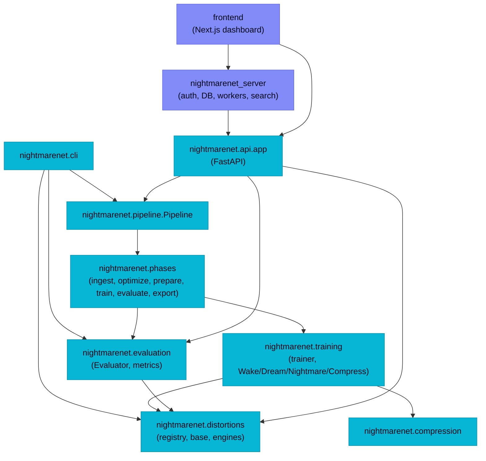
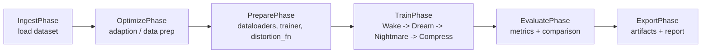
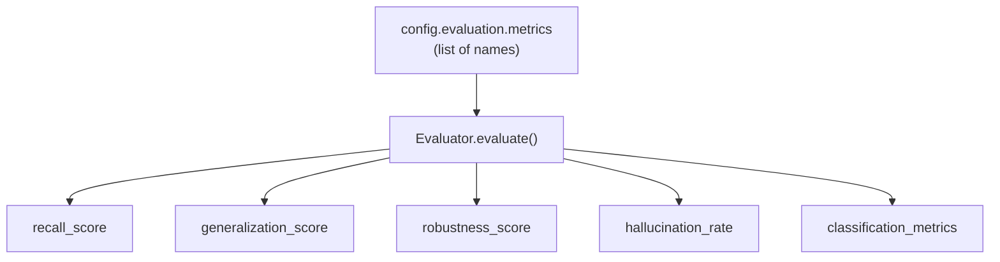

# Architecture Overview

This document maps the NightmareNet codebase for new contributors: how the modules depend on each other, how the training pipeline flows, and where the OSS core ends and the hosted server begins.

## Module relationships

The OSS core (`nightmarenet/`) is self-contained. The hosted server (`nightmarenet_server/`) and the Next.js `frontend/` build on top of it, but the core never imports from them.



> [!IMPORTANT]
> The OSS core (`nightmarenet/`) must **not** import from `nightmarenet_server/`, and must not depend on PostgreSQL, Redis, Celery, or OAuth libraries. See the OSS/hosted boundary table in [`CONTRIBUTING.md`](../../CONTRIBUTING.md#architecture-pointers).

## Pipeline phase flow

`Pipeline.run()` (in [`nightmarenet/pipeline.py`](../../nightmarenet/pipeline.py)) executes a fixed sequence of orchestration phases, each implemented as a `Phase` subclass. `EvaluatePhase` internally invokes `ExportPhase`.



Each orchestration phase implements the abstract base in [`nightmarenet/phases/base.py`](../../nightmarenet/phases/base.py):

```python
class Phase(abc.ABC):
    name: str = "phase"

    @abc.abstractmethod
    def execute(self, context: PipelineContext) -> PhaseResult:
        ...
```

- **`PipelineContext`** is a dataclass holding all mutable run state (`run_id`, `config`, `dataset`, `train_dl`, `trainer`, `history`, `trained_results`, `comparison`, `report_md`, …). Each phase reads and mutates it in place.
- **`PhaseResult`** reports `success`, `phase_name`, an optional `error`, and a `data` dict.

The four *training* sub-phases (Wake → Dream → Nightmare → Compress) run **inside** `TrainPhase`; their implementations live in `nightmarenet/training/` (trainer and phase logic), not in `nightmarenet/phases/`.

## Evaluation flow

`EvaluatePhase` uses the `Evaluator` (in [`nightmarenet/evaluation/evaluator/core.py`](../../nightmarenet/evaluation/evaluator/core.py)), which dispatches string metric names to functions in [`nightmarenet/evaluation/metrics.py`](../../nightmarenet/evaluation/metrics.py):



See [Adding Metrics](adding-metrics.md) for how to extend this dispatch.

## Key entry points

| Entry point | Location | Role |
|---|---|---|
| `Pipeline` | `nightmarenet.pipeline` | Orchestrates the 4-phase cycle. |
| `main` | `nightmarenet.cli` | The `nightmarenet` console command. |
| `get_registry` | `nightmarenet.distortions.registry` | Lazy-singleton distortion registry. |
| `Evaluator` | `nightmarenet.evaluation.evaluator` | Multi-strength robustness scoring. |
| `app` | `nightmarenet.api.app` | FastAPI app for the OSS HTTP surface. |

## Server architecture

The hosted server (`nightmarenet_server/`) adds authentication, a multi-tenant database, Celery workers, and semantic experiment search on top of the OSS API. It is documented separately in [`docs/development/local-stack.md`](local-stack.md); the deployment topology and OSS/hosted split are described in [`docs/architecture/`](../architecture/).

## Related Documentation

- [Adding Distortions](adding-distortions.md) — extend the distortion registry.
- [Adding Metrics](adding-metrics.md) — extend the evaluator.
- [Local Stack](local-stack.md) — run the API + frontend locally.
- [`CONTRIBUTING.md`](../../CONTRIBUTING.md) — the OSS/hosted boundary and entry points.
